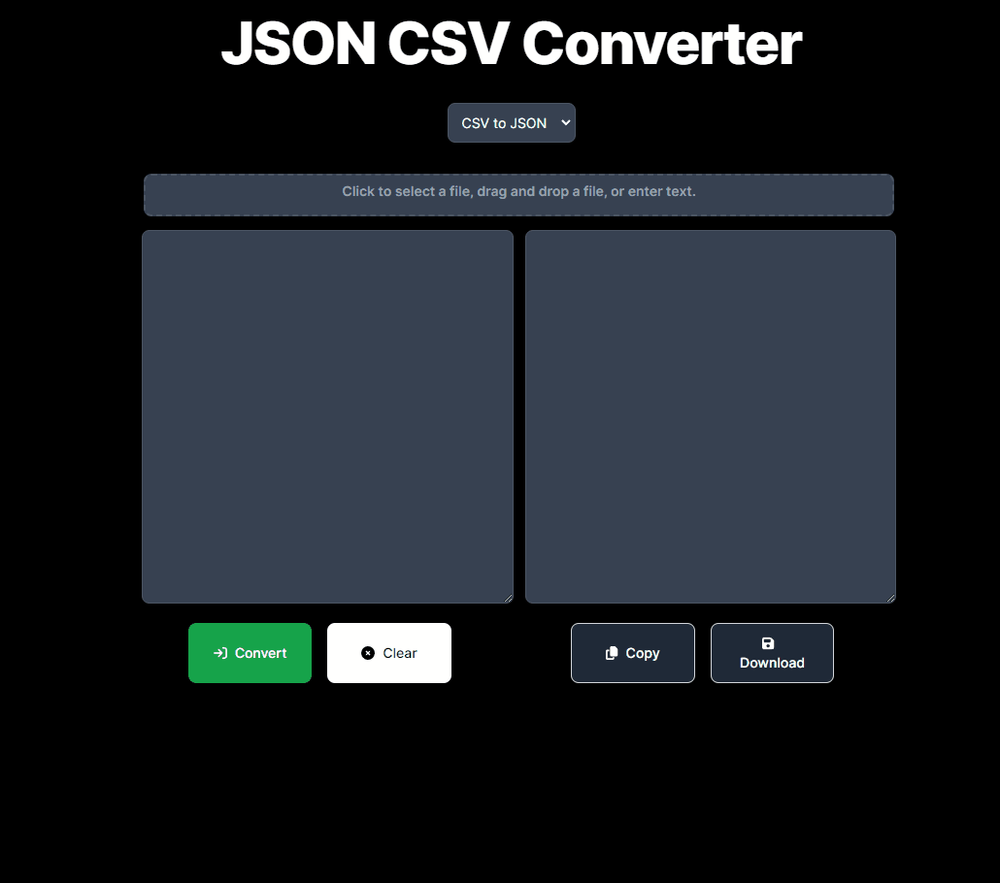
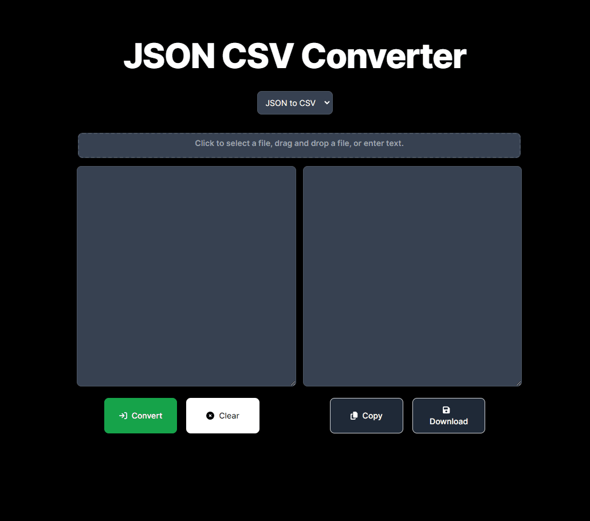

# JSON CSV Converter

## Table of contents
1. [Description](#description)
2. [Technology](#technology)
3. [Installation](#installation)
4. [Usage](#usage)
5. [Acknowledgements](#acknowledgements)

## Description

This web tool, built with Next.js, seamlessly converts data between JSON and CSV formats. Users can input raw text or upload files using a standard uploader or drag-and-drop functionality. After conversion, users can easily copy the results to their clipboard or save them to a file.

## Technology
* [NPM](https://docs.npmjs.com/downloading-and-installing-node-js-and-npm)
* [Next.js](https://nextjs.org/docs)
* [Tailwind CSS](https://v2.tailwindcss.com/docs)
* [Jest.js](https://jestjs.io/docs/getting-started)
* [React-toastify](https://www.npmjs.com/package/react-toastify)

## Installation

1. Clone and install the project locally.
```bash
git clone https://github.com/DavidLapadula/JsonCsvConverter.git
cd jsoncsvconverter
```

2. Install packages. 
```bash
npm install
```

3. Verify functionality by running the unit tests.

```bash
npm run test
```

4. Run the project. It should be available at It should be available at **localhost:3000**. 

```bash
npm run dev
```

## Usage

#### CSV to JSON

#### JSON to CSV

#### Upload file

#### Drag and drop file


## Acknowledgements

The inspiration for this application came from an excellent list of ideas created by **[florinpop17](https://github.com/florinpop17/app-ideas)**. Make sure to check the list out when deciding on your next personal project.
